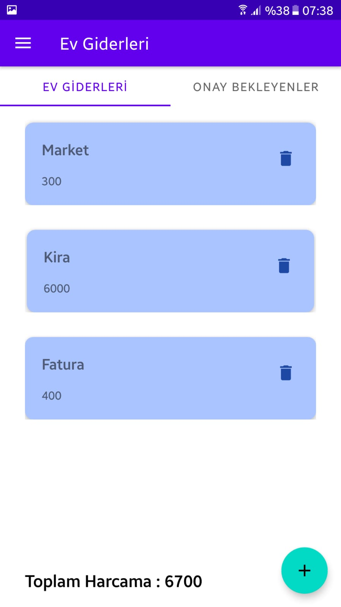
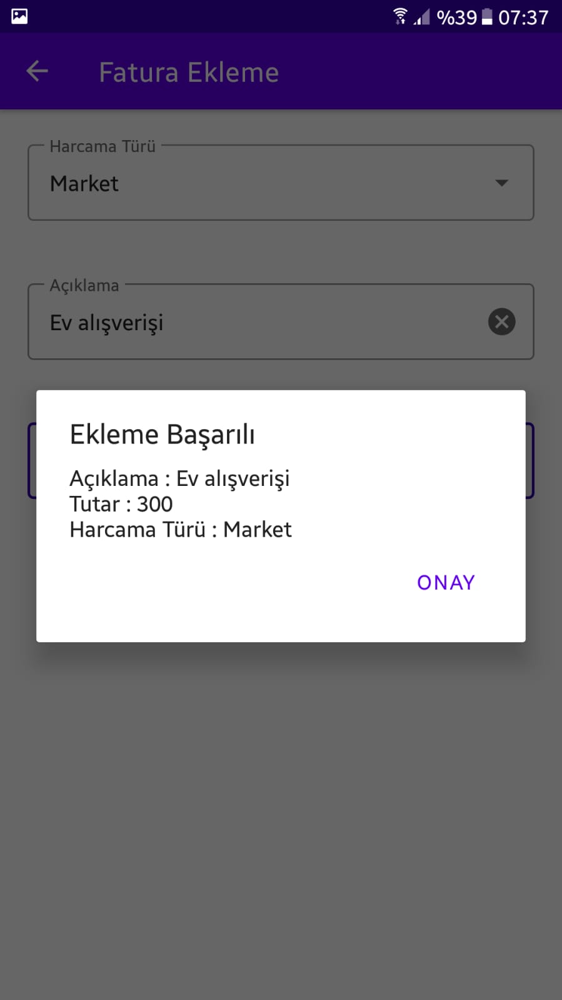
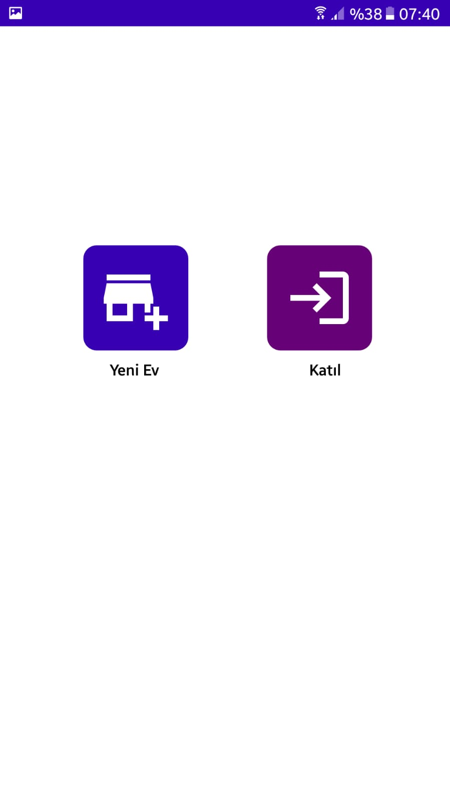
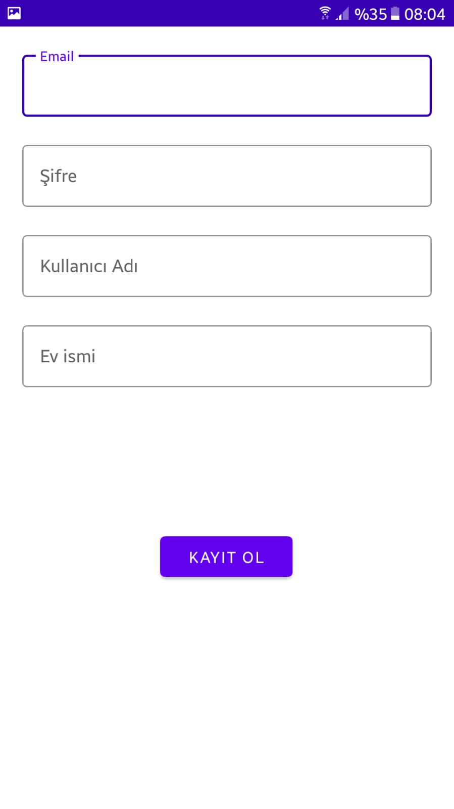

# Home Expenses
Home Expenses is an application where you can track your expenses together with your housemates.
Native application for android devices.
Built with **Kotlin**. (still in development)

## Technologies
- The project follows **MVVM** and Single Activity structure,
- **Jetpack Navigation** and Navigation Draver for navigating,
- **Firebase Auth** for authentication, **Firestore** for storage.
- **Room** Database for local storage and caching,

  
## Creator
  Atila İlhan Yatağan  
  Computer Science Student At Marmara University

## Screenshots
<table>
  <tr>
     <td>Homepage</td>
     <td>Detail Page</td>
     <td>Receipt Added</td>
     <td>Receipt Failed</td>
    
  </tr>
  <tr>
    <td></td>
    <td></td>
    <td></td>
    <td></td>
  </tr>
 </table>
 
 <table>
  <tr>
     <td>Login Screen</td>
     <td>Register Screen</td>
     <td>New Home Registeration</td>
     <td>Home Details Page</td>
  </tr>
  <tr>
    <td></td>
    <td></td>
    <td></td>
    <td></td>
  </tr>
 </table>
 
